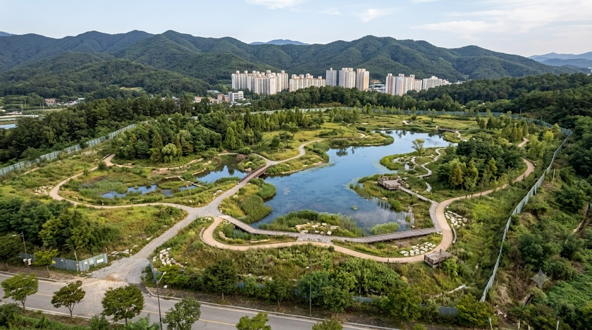
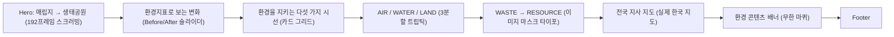

# 🌳 한국환경공단 리뉴얼

> 실제 서비스가 아닌, 한국환경공단 홈페이지를 "매립지 → 생태공원 → 자원순환"으로 이어지는
> 스크롤 기반 환경 스토리텔링 경험으로 다시 그려본 개인 리뉴얼 랜딩페이지

<p>
  
  
  
  
  
</p>

## 🖼️ 구현 결과
| 매립지 → 생태공원 (Before / After 비교 슬라이더) |
|---|
|  |

스크롤 연출·영상 전환이 핵심이라 정지 이미지로는 느낌이 잘 안 살아요. 실제 스크롤 경험은
[economy-eight-flame.vercel.app](https://economy-eight-flame.vercel.app)에서 직접 확인해보시는 걸 추천합니다.
로컬에서 직접 돌려보고 싶다면 `npm install && npm run dev`.

## ✨ 주요 기능 & 인터랙션

### 1. 매립지 → 생태공원, 192프레임 캔버스 스크러빙 히어로
`Hero` 섹션은 매립지가 생태공원으로 변해가는 과정을 담은 192장의 정지 프레임을 미리 로드한 뒤,
`ScrollTrigger`의 스크롤 진행률(progress)을 그대로 프레임 인덱스에 매핑해 `<canvas>`에 그리는 방식으로
영상처럼 부드럽게 재생되는 스크러빙 인터랙션을 구현했습니다. 좌측 고정 내비게이션(01 매립지 ~ 05
생태공원)의 활성 단계와 진행 바(rail fill)도 같은 진행률로 동기화됩니다.

### 2. AIR / WATER / LAND — 한 화면에 담은 3분할 시네마틱 트립틱
"카드 여러 개"가 아니라, 대기·물·토양을 한 화면 안에서 동시에 보여주는 3분할 풀스크린 구성으로
설계했습니다. 각 컬럼은 독립된 배경 이미지 위에 얇은 타이포그래피와 짧은 영문 태그라인을 올리고,
`IntersectionObserver` 기반의 가벼운 `ScrollTrigger` fade-in만 적용해 과도한 연출 없이 화면에
진입할 때 자연스럽게 드러나도록 했습니다.

### 3. WASTE → RESOURCE, 이미지 마스크 타이포그래피
"폐기물이 자원이 되는" 핵심 메시지를 카드나 표가 아니라, 화면 너비를 가득 채우는 대형 타이포그래피로
표현했습니다. `background-clip: text`로 WASTE 글자 안에는 매립지 이미지를, RESOURCE 글자 안에는
생태공원 이미지를 채워 넣고, 스크롤 진행률에 따라 두 글자 속 이미지가 서로 다른 방향으로 아주 느리게
흐르도록 `backgroundPositionX`를 스크럽해 "순환"의 느낌을 살렸습니다.

### 4. 실제 대한민국 행정구역 데이터 기반 전국 지사 지도
지사 위치 안내는 손으로 그린 도형이 아니라, 실제 대한민국 17개 시·도 SVG 경계 데이터
(`@svg-maps/south-korea`, CC BY 4.0)를 파싱해 만든 지도 위에 실제 지사 주소 기준 좌표로 마커를
배치했습니다. 마커를 클릭하거나 마우스를 올리면 해당 지사의 주소·전화번호가 옆 패널에 표시됩니다.

## 🧭 사용자 플로우


## 🗂️ 폴더 구조
```
├── src/
│   ├── App.jsx              # 전체 섹션 조립 순서
│   ├── components/          # 섹션별 컴포넌트 (Hero, PressReleaseSection, EcoTvSection, WasteToResourceSection, BranchMap 등)
│   ├── lib/
│   │   ├── scrollStage.js   # 여러 pin+scrub 섹션이 공유하는 스크롤 진행도 계산 헬퍼
│   │   └── koreaMapPaths.js # 실제 대한민국 17개 시·도 SVG path 데이터
│   └── index.css            # 전역 스타일 · 디자인 토큰(CSS 변수)
├── public/
│   ├── frames/               # Hero 캔버스 스크러빙용 192장 정지 프레임
│   └── images/, videos/      # 섹션별 사진·영상 에셋
└── archive/                  # 초기 정적 HTML 프로토타입 (참고용, 실서비스 미사용)
```

## 🤖 AI 활용 프로세스
Claude Code와 함께 여러 라운드에 걸쳐 작업했습니다. 처음엔 텍스트 스펙만으로 섹션을 구현했다가,
실제 레퍼런스 디자인 이미지를 받은 뒤 AIR/WATER/LAND 구조를 3분할 정적 레이아웃으로 전면
재설계했고, "실제 한반도 지도로 해달라"는 요청을 받아 오픈소스 SVG 지도를 찾아 파싱해 반영했습니다.
스크롤 인터랙션 설계, GSAP 애니메이션 구현, 실제 지리 데이터 조사, 그리고 몇 차례의 리팩터링까지
전 과정을 대화로 주고받으며 만들었습니다.

## 🩹 트러블슈팅
| 이슈 | 원인 | 해결 |
|---|---|---|
| AIR/WATER/LAND 섹션이 모바일에서 인트로 화면만 보이고 나머지가 전혀 보이지 않음 | 가로 핀 스크롤(pin+scrub) 애니메이션을 모바일에서는 성능상 비활성화했는데, 비활성화 시의 세로 대체 레이아웃이 없어서 나머지 패널이 화면 밖에 묻힘 | 가로 핀 스크롤 방식 자체를 걷어내고, 3개 컬럼을 처음부터 정적으로 배치한 뒤 가벼운 fade-in만 추가하는 방식으로 재설계 |
| WASTE/RESOURCE 이미지 마스크 타이포그래피가 `background-clip: text` 미지원 브라우저에서 텍스트가 아예 안 보임 | `color: transparent` + `background-clip: text` 조합은 미지원 브라우저에서 글자가 투명한 채로 남음 | `@supports not (background-clip: text)` 폴백으로 흰색 텍스트를 강제 지정 |
| `WASTE → RESOURCE`, `MEDIA & INFO` 섹션에서 전역 배경 영상이 비치지 않고 항상 단색(노란빛)으로만 보임 | 두 섹션이 다른 섹션(`env-change`, `env-fields`, `branch-map`)과 달리 불투명한 `paper-100` 배경색을 그대로 사용해, `position: fixed`로 화면 뒤에 깔린 전역 배경 영상을 완전히 가림 | 두 섹션의 배경을 `transparent`로 변경해 다른 섹션과 동일하게 전역 배경 영상이 비쳐 보이도록 수정 |

## 📄 라이선스
MIT (지도 데이터는 `@svg-maps/south-korea`, CC BY 4.0 별도 표기)
